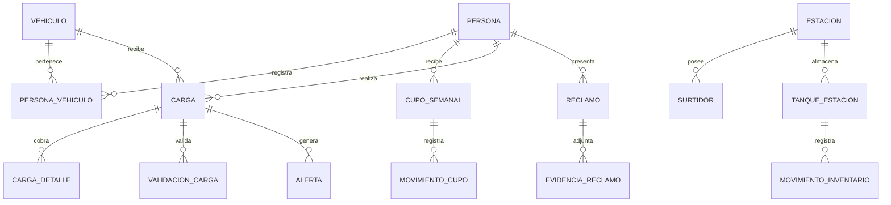

# Control de combustible subvencionado

Esquema PostgreSQL para un taller académico sobre cargas de combustible, cupo semanal, inventario y detección de operaciones sospechosas. Está preparado como migración de Supabase. El repositorio contiene **estructura y parámetros de ejemplo**, nunca datos de ciudadanos ni credenciales.

## Contenido

- `supabase/migrations/20261007024602_esquema_inicial_combustible.sql`: 27 tablas, relaciones, restricciones, índices, disparadores y parámetros iniciales.
- `supabase/config.toml`: configuración local generada por Supabase CLI.

## Modelo

| Área | Tablas |
| --- | --- |
| Personas y vehículos | `persona`, `biometria`, `vehiculo`, `persona_vehiculo` |
| Cupo y precios | `cupo_semanal`, `movimiento_cupo`, `combustible`, `precio_combustible`, `parametro_sistema` |
| Estaciones e inventario | `estacion`, `surtidor`, `tanque_estacion`, `recepcion_combustible`, `movimiento_inventario` |
| Cargas y control | `operador`, `operador_estacion`, `carga`, `carga_detalle`, `validacion_carga`, `evidencia_carga`, `alerta`, `bloqueo`, `anulacion_carga` |
| Reclamos y administración | `reclamo`, `evidencia_reclamo`, `usuario_sistema`, `auditoria` |



## Reglas implementadas en la base

- Una persona puede tener como máximo **dos vehículos activos**, configurable en `parametro_sistema`; cada vehículo solo puede tener un propietario activo.
- El cupo es por persona y por semana de lunes a domingo. Gasolina y diésel comparten el cupo. Los movimientos de consumo, devolución y ajuste actualizan el saldo dentro de la misma transacción.
- La carga offline no admite detalle a precio subvencionado. Una carga completada requiere hora de fin y que la suma de sus detalles sea igual a los litros despachados.
- Los movimientos de inventario verifican el saldo anterior y actualizan el tanque en forma atómica.
- La anulación conserva la carga y cambia su estado a `ANULADA`.
- Los intentos de huella se limitan por parámetro. La columna `biometria.huella` es solo una **referencia opaca** a una plantilla protegida fuera de esta base; no debe contener una imagen ni datos biométricos sin cifrar.
- Las tablas tienen RLS habilitado y no incluyen políticas para clientes. El esquema se administra con una conexión privilegiada. Antes de construir una aplicación pública se deben definir usuarios, permisos y políticas por rol.

## Reglas que requieren la aplicación o servicios externos

La base guarda resultados e historial, pero la verificación real de huellas, RUAT, rutas de mapas, capacidad del tanque, riesgos y sincronización offline necesita servicios y lógica de aplicación. Los archivos de evidencia deben guardarse en un almacenamiento privado; aquí se registra únicamente su referencia. La devolución de un reclamo aceptado, los ajustes por anulación y el cálculo del riesgo deben ejecutarse como operaciones de negocio auditadas.

Los porcentajes de diferencia de inventario (1 % y 2 %) son **valores académicos configurables**, no una norma oficial. No se cargan precios reales; `precio_combustible` debe poblarse con fuentes vigentes y conservar los registros históricos.

## Despliegue

Con Supabase CLI autenticado y el proyecto remoto ya creado:

```sh
supabase link --project-ref TU_PROJECT_REF
supabase db push --dry-run
supabase db push
```

Para probar localmente se requiere Docker:

```sh
supabase start
supabase db reset
```

No publiques contraseñas, claves de servicio, datos personales ni plantillas biométricas en este repositorio.

